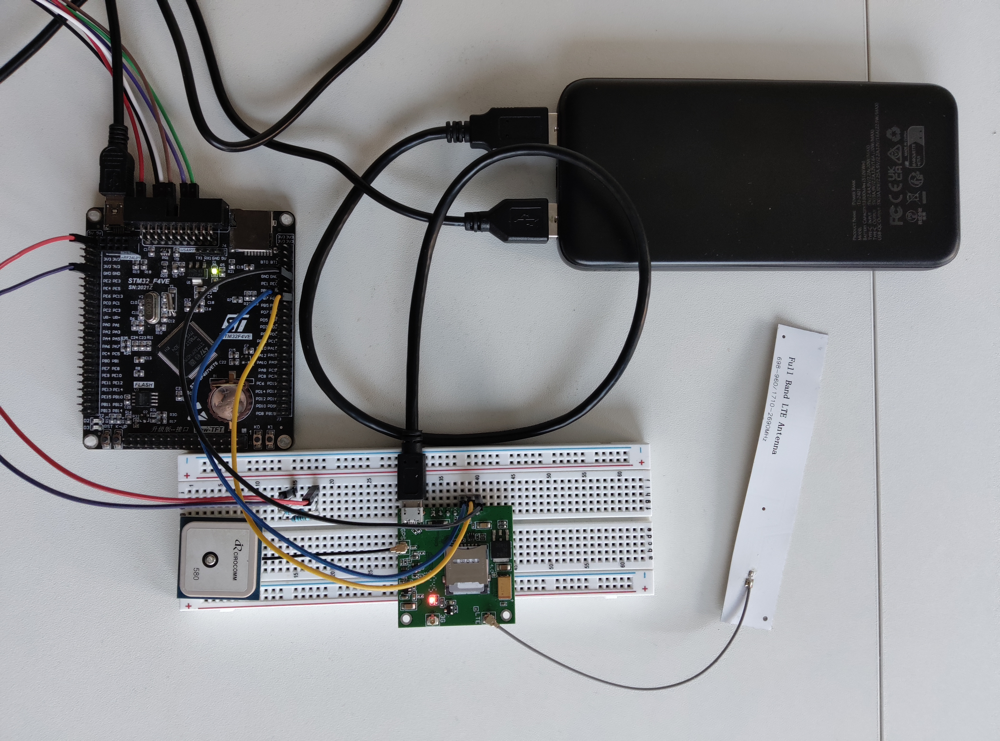
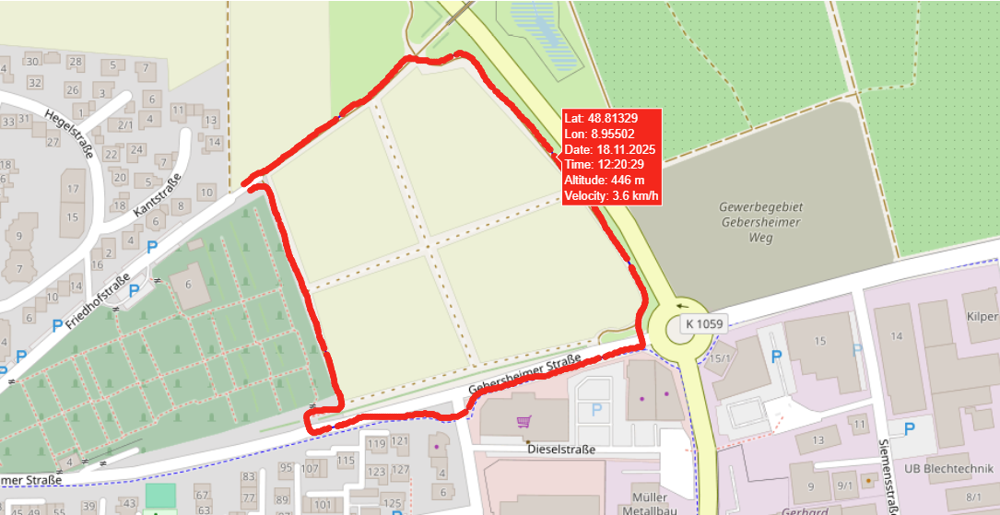

# 🛰️ STM32F4 Cellular GPS Asset Tracker: System Overview

This repository serves as the definitive, **code-free technical documentation** for a proof-of-concept asset tracking solution built from the ground up. The project demonstrates an entire IoT data path: from bare-metal hardware acquisition and cellular transmission to database storage and web visualization.

---

## 💡 Project Scope and Achievement

This system was engineered to deliver a highly reliable, low-power asset tracking solution utilizing:

* **Firmware:** Custom, **bare-metal C** implementation on the STM32F4 for maximum performance and memory control.
* **Hardware:** Integrated SIM7600E module for GPS and LTE connectivity.
* **Backend:** A dedicated C server application for data ingestion, persistence, and plotting.

---

## ⚙️ Architectural Components

The project is broken down into three distinct, communicating layers:

### 1. Embedded Firmware (The Client)

The tracking logic runs on the STM32F407 and is responsible for hardware initialization, data collection, and robust communication protocols.

* **Platform:** STM32F407VETx Development Board.
* **Core Implementation:** All software is written **from scratch in bare-metal C**, focusing on efficiency and deterministic execution. **Low-level drivers** (e.g., UART, GPIO) are implemented based on principles and information provided in the following resource: [PacktPublishing/Bare-Metal-Embedded-C-Programming](https://github.com/PacktPublishing/Bare-Metal-Embedded-C-Programming).
* **GPS Acquisition:** Logic handles the SIM7600E AT commands for GPS fix retrieval and state monitoring (including LED indicators for Initialization and Transmission Errors).
* **Transmission Logic:** Implements HTTP POST requests to package collected GPS data and send it to the external server.

### 2. Hardware Prototype (The Tracker Board)

* **Microcontroller:** STM32F407-based Development Board.
* **Connectivity:** **SIM7600E** LTE Cat-1 Module Board for cellular communication (4G data transmission).
* **Power Supply:** Uses a standard USB Power Bank for portable, real-world testing.
* **Status Interface:** Dual LED status indicators provide immediate visual diagnostics, signaling:
    * `ERROR_INIT` (Hardware/Configuration Failure)
    * `ERROR_RUNTIME` (Data/Processing Failure)
    * `ERROR_TX` (Critical Communications Failure)
  
  

### 3. Data Server & Visualization (The Backend)

The server component, developed in C, is the data ingestion and display endpoint for the tracking system.

* **Server Repository:** [AndreasCnaus/simple\_http\_server: HTTP server that receives GPS data via POST requests and stores it in an SQLite database](https://github.com/AndreasCnaus/simple_http_server)
* **Data Ingestion:** The server receives raw tracking packets from the STM32F4 client via **HTTP POST requests**.
* **Data Storage:** Received GPS coordinates and timestamps are securely saved in an **SQLite database**.
* **Visualization:** Data queried from the database is rendered into dynamic map and plot using the **Plotly** library, enabling analysis of the asset's movement history.

