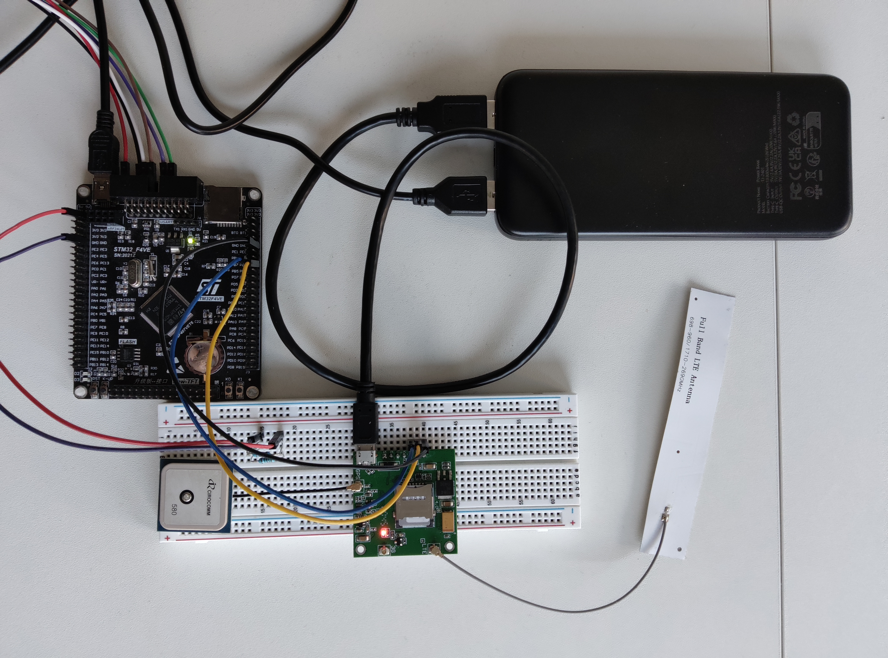
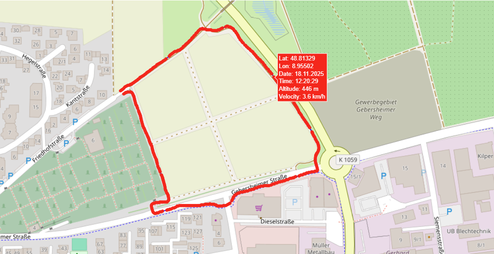

# 🛰️ Cellular GPS Asset Tracker: System Overview & Custom Hardware Evolution

This repository serves as the technical documentation and code for an end-to-end, intelligent IoT asset tracking solution. The project demonstrates an entire industrial IoT data path: from bare-metal hardware acquisition and cellular transmission to database storage and web visualization.

---

## 🚀 Project Status: Prototype Success to Custom Hardware Evolution

This project is actively moving from a successful **Proof-of-Concept (PoC)** phase into a **Next-Generation Custom Hardware** architecture.

* **Phase 1: Full-Stack Proof of Concept (Completed):** A complete end-to-end working system was engineered using an STM32F407, a **SIM7600E** cellular shield, a custom bare-metal C client, and a dedicated C backend server.
* **Phase 2: Custom Hardware Migration (In Progress):** To transition the system into a compact, low-power industrial product, the architecture is being migrated to a fully custom-designed PCB. This replaces the bulky development boards with a highly optimized, integrated circuit layout.

---

## 🛠️ Next-Generation Custom Hardware Architecture (WIP)

The upcoming hardware iteration transitions the project to an ultra-efficient, production-ready design. The new hardware design is structured hierarchically in KiCad, with all design files located in the `hardware/` folder. You can view the full multi-sheet layout here: **[View / Download the Schematic PDF](./hardware/ST87M01_Tracker_Board.pdf)**

### Key System Components & Schematic Hierarchy

* **Host_MCU (The Brain):** Centers around the **STM32G0B0CET6** microcontroller to manage low-level peripherals, handle sensor interrupts, and run state machines. This choice provides massive power savings and a reduced footprint over the prototyping board while maintaining rich peripheral support (UARTs, SPI, I2C).
* **NB_IoT_Modem (The Network Layer):** The RF and network interface layer built around the integrated **ST87M01-1301** module, leveraging its advanced industrial NB-IoT/LTE-M connectivity and deep sleep power states.
* **Motion Detection (Low-Power Wakeup):** Features an integrated **LIS3DH** 3-axis accelerometer. This enables low-power motion detection algorithms, allowing the host MCU and modem to remain in an ultra-low-power deep sleep state until a physical movement threshold triggers a hardware interrupt.
* **Li-Ion Cell Charge Management & Protection:** Dedicated, onboard lithium-ion charging circuitry designed for battery safety, longevity, and reliable field deployment (enabling solar/USB harvesting configurations). It includes integrated hardware protection circuits safeguarding the battery against over-voltage, under-voltage, and over-current conditions.
* **Power Rails (Segmented Regulation):** An optimized multi-rail power distribution network featuring a buck-boost converter and a low-dropout LDO regulator. 
---

## ⚙️ Architectural Components (PoC Baseline)

The existing, validated tracking architecture is split into three distinct, communicating layers:

### 1. Embedded Firmware (The Client)

The tracking logic runs on the STM32F407 and is responsible for hardware initialization, data collection, and robust communication protocols.

* **Platform:** STM32F407VETx Development Board.
* **Core Implementation:** All software is written **from scratch in bare-metal C**, focusing on efficiency and deterministic execution. **Low-level drivers** (e.g., UART, GPIO) are implemented based on principles and information provided in the following resource: [PacktPublishing/Bare-Metal-Embedded-C-Programming](https://github.com/PacktPublishing/Bare-Metal-Embedded-C-Programming).
* **GPS Acquisition:** Logic handles the SIM7600E AT commands for GPS fix retrieval and state monitoring (including LED indicators for Initialization and Transmission Errors).
* **Transmission Logic:** Implements HTTP POST requests to package collected GPS data and send it to the external server.

### 2. Hardware Prototype (The Tracker Board)

* **Microcontroller:** STM32F407-based Development Board.
* **Connectivity:** **SIM7600E** LTE Cat-1 Module Board for cellular communication (4G data transmission).
* **Power Supply:** Uses a standard USB Power Bank for portable, real-world testing.
* **Status Interface:** Dual LED status indicators provide immediate visual diagnostics, signaling:
    * `ERROR_INIT` (Hardware/Configuration Failure)
    * `ERROR_RUNTIME` (Data/Processing Failure)
    * `ERROR_TX` (Critical Communications Failure)
  

### 3. Data Server & Visualization (The Backend)

The server component, developed in C, is the data ingestion and display endpoint for the tracking system.

* **Server Repository:** [AndreasCnaus/Tracker_HTTP_Server: HTTP server that receives GPS data via POST requests and stores it in an SQLite database](https://github.com/AndreasCnaus/Tracker_HTTP_Server)
* **Data Ingestion:** The server receives raw tracking packets from the STM32F4 client via **HTTP POST requests**.
* **Data Storage:** Received GPS coordinates and timestamps are securely saved in an **SQLite database**.
* **Visualization:** Data queried from the database is rendered into dynamic maps and plots using the **Plotly** library, enabling real-time analysis of the asset's movement history.

---
